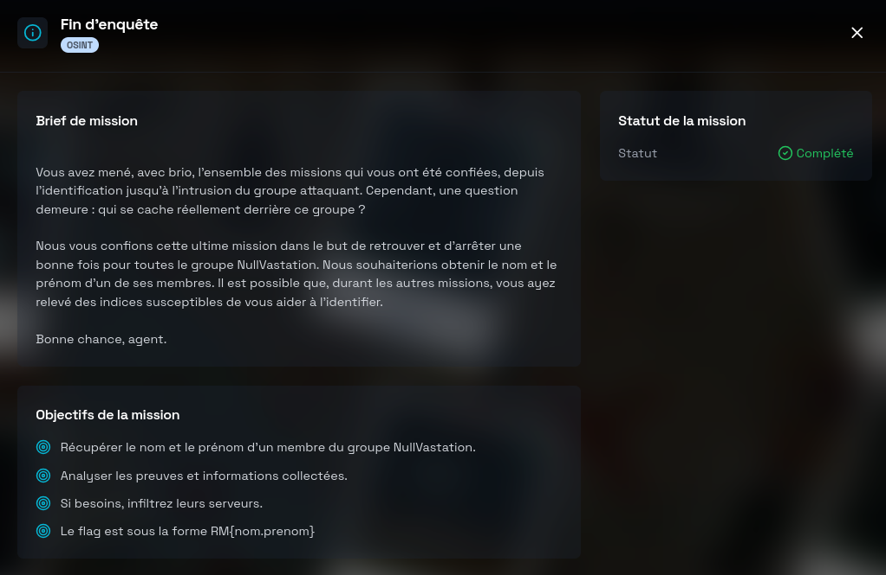
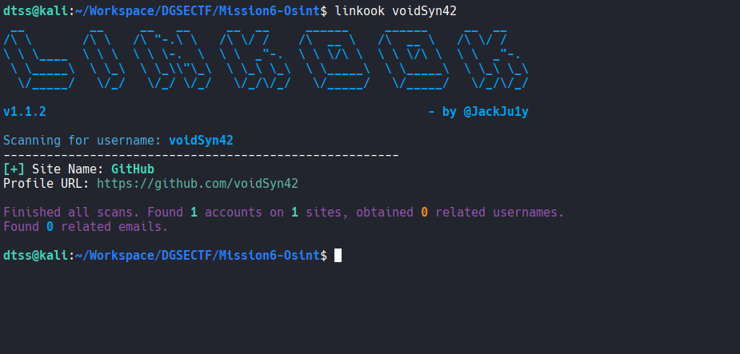
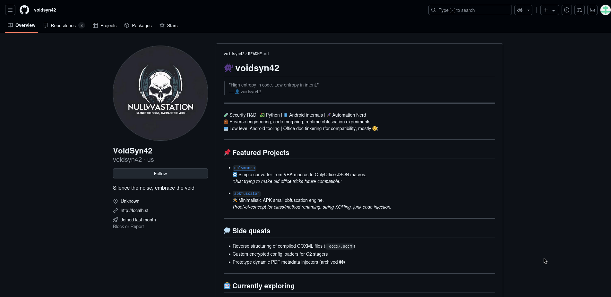
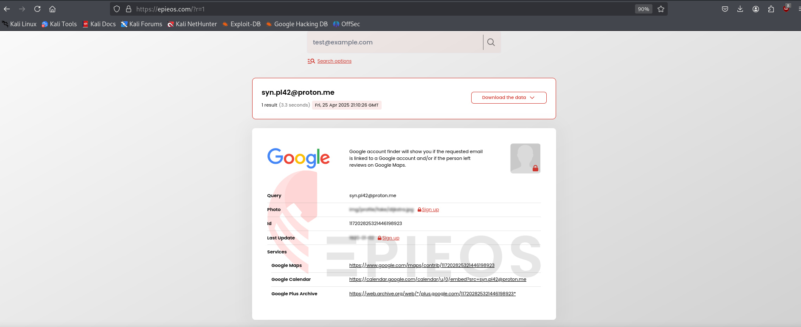
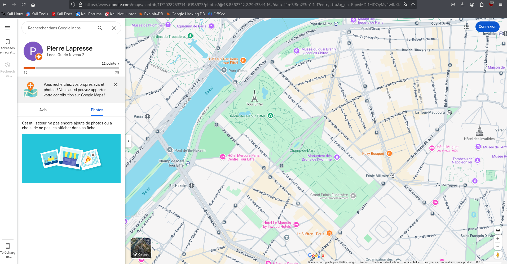

# Fin d'enquête DGSE x Root-Me (OSINT)



# Writeup

Toutes les missions précédentes nous ont permis de collecter des informations sur le groupe attaquant NullVastation, de plus, un des objectifs de la mission nous oriente particulièrement : c'est sur leurs serveurs que se trouvent les dernières pièces du puzzle.

- Voici ce que l'on a retenu à ce sujet :

Une adresse IP a attiré notre attention tout au long des missions : **163.172.67.201**

> [!NOTE]
> On l'a d'abord retrouvée lors de l'analyse des logs durant la mission SOC, liée à l'utilisation d'outils suspects.
Lors de la mission 3, elle servait à héberger et distribuer des scripts malveillants, et enfin, pendant la mission 5, elle était utilisée pour diffuser des messages chiffrés.

Lors de notre quatrième mission nous avons mis la main sur plusieurs mots de passe du groupe. Parmi eux, un mot de passe SSH pour un utilisateur nommé `operator` était accompagné d'une note : 

```
SSH password for the attacking machine. The IP address changes regularly, please refer to the last operation to obtain it.
```
--> Nous pouvons déduire que l'adresse IP de la machine attaquante est donc 163.172.67.201 sur laquelle on peut se connecter grâce aux credentials de `operator`.

- En arrivant sur la machine on retrouve le dossier tools avec les scripts des différents outils des missions.

- En explorant les différents outils et en lisant le readme.md qui explique le fonctionnement de nighshade, on peut voir un pseudo : 


```md
- By **voidSyn42**
```

- On peut utiliser "linkook", qui est un outil OSINT qui permet d'identifier, à partir d'un simple nom d'utilisateur, les comptes sur les réseaux sociaux ainsi que les adresses e-mail associées à celui-ci :



Nous avons un résultat ; Un profil GitHub **https://github.com/voidSyn42**

> Ce profil reprend le slogan du groupe NullVastation "Silence the noise, embrace the void" ainsi que la photo de profil :



--> On sait maintenant que ce mystérieux individu est un membre de NullVastation.

- En regardant l'activité du profil, on remarque qu’il y a plusieurs commits répartis sur trois dépôts publics.

> C’est peut-être une piste intéressante à creuser.

- En se renseignant sur les commits GitHub, on apprend que l'on peut récupérer des informations supplémentaires grâce à l’API ( [doc](https://docs.github.com/en/rest/commits/commits?apiVersion=2022-11-28#get-a-commit)
)

- La commande suivante permet d'extraire les adresses e-mail associées aux commits :

```bash
curl -s -H "Accept: application/vnd.github.cloak-preview" \
  "https://api.github.com/search/commits?q=author:voidsyn42" \
| grep -Po '"email":\s*"\K[^"]+' \
| sort | uniq -c
```
**Résultat** :

noreply@github.com (2 occurrences), qui correspond aux commits anonymisés par GitHub.

syn.pl42@proton.me (16 occurrences), qui semble être l’adresse principale utilisée par voidSyn42 pour valider ses commits.

- On cherche à obtenir davantage d’informations sur cette nouvelle adresse Proton.

- En utilisant l'outil Epieos (un outil OSINT spécialisé dans la corrélation d'adresses e-mail entre différents fournisseurs), on trouve une correspondance :



Cette adresse est reliée à un compte Google, Epios nous permet également d'identifier les services liés à ce compte.

- En consultant le lien Google Maps, ce compte apparaît sous le nom de **Pierre Lapresse** :



- Cela nous donne le nom et le prénom de l’individu derrière le pseudo **voidSyn42**.

- On peut donc clore l'enquête et soumettre le flag sous la forme RM{nom.prenom}.

**Flag:**
```
RM{lapresse.pierre}
```
